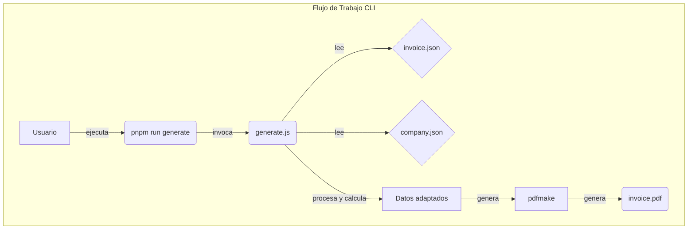
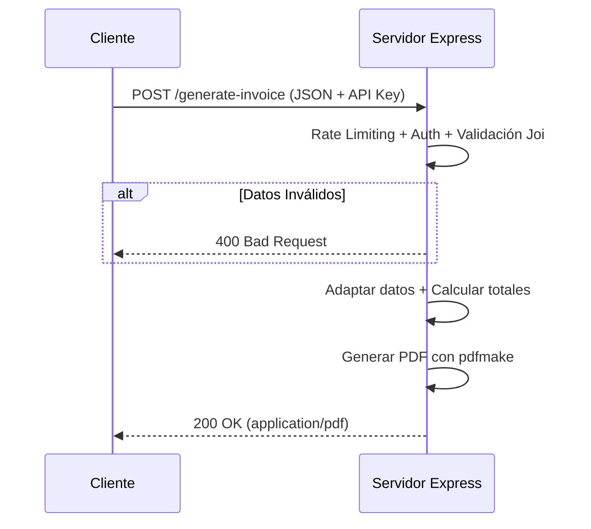

# Generador de Facturas en PDF con Node.js

Genera facturas y cotizaciones en PDF a partir de datos JSON. Usa **pdfmake** — sin Puppeteer, sin Chromium, sin dependencias pesadas.

Incluye CLI para uso directo y API REST lista para integrarse con n8n, Zapier, o cualquier backend.

---

## Diagramas de Flujo

### Flujo de Trabajo (CLI)



### Flujo de Trabajo (API)



---

## Características Principales

- **Ligero:** Solo pdfmake (~500KB). Sin Chromium (~400MB).
- **Generación Dual:** CLI y API REST.
- **Cálculos Automáticos:** Subtotales, impuestos múltiples (IVA, ICA, etc.), descuentos por item y global.
- **Total en Letras:** Conversión automática a texto en español.
- **Logo Incrustado:** Imágenes embebidas en base64, PDF autocontenido.
- **Multi-página:** La tabla de items fluye entre páginas sin header repetido; el footer lleva número de página en todas y el logo pequeño en la última.
- **API Segura:** Auth por API Key + rate limiting.
- **Validación:** Esquemas Joi para datos de entrada.
- **Docker:** Imagen base `node:20-alpine` (~50MB vs ~800MB antes).

---

## Requisitos

- **Node.js**: v18.0 o superior
- **Gestor de Paquetes**: pnpm (recomendado) o npm

---

## Estructura del Proyecto

```
invoice_html_project/
├── generate.js                   # Script CLI
├── src/
│   ├── api/server.js             # Servidor Express (API REST)
│   ├── assets/
│   │   ├── fonts/                # DanhDa-Bold (título) + Montserrat (cuerpo)
│   │   ├── logo.png              # Logo principal (header, página 1)
│   │   └── logo-small.png        # Logo pequeño (footer, última página)
│   ├── data/
│   │   ├── company.json          # Datos de la empresa (NIT, teléfono, etc.)
│   │   ├── invoice.json          # Ejemplo de factura corta
│   │   └── factura-large.json    # Ejemplo de factura larga (multi-página)
│   ├── output/                   # PDFs generados (gitignored)
│   └── utils/
│       ├── doc_definition.js     # Builder de docDefinition para pdfmake
│       ├── invoice_schema.js     # Validación Joi
│       └── invoice_utils.js      # Lógica de negocio (totales, nº a texto)
├── tests/                        # Tests uvu (47 en total)
│   ├── api-invoice.test.js       # Integración API (requiere servidor)
│   ├── unit-doc_definition.test.js
│   └── unit-invoice_utils.test.js
├── Dockerfile
└── package.json
```

---

## Datos de la Empresa

Los datos de la empresa viven en `src/data/company.json`. Este archivo se carga automáticamente por el CLI, la API, y como fallback por `buildDocDefinition()`.

```json
{
  "name": "Mi Empresa S.A.S.",
  "logo": "logo.png",
  "logo_small": "logo-small.png",
  "tax_id": "900123456-7",
  "phone": "57 300 123 4567",
  "city": "Bogotá, Colombia",
  "website": "www.miempresa.com"
}
```

### Campos de `company.json`

| Campo | Tipo | Descripción |
|---|---|---|
| `name` | string | Nombre de la empresa. Aparece como título en el header. |
| `logo` | string | Archivo de imagen del logo principal (relativo a `src/assets/`). Aparece a la izquierda del header en la primera página. |
| `logo_small` | string | Archivo de imagen del logo pequeño (relativo a `src/assets/`). Aparece en el footer de la última página junto al número de página. |
| `tax_id` | string | NIT o identificación tributaria. Aparece en el header. |
| `phone` | string | Teléfono de contacto. Aparece en el header. |
| `city` | string | Ciudad y departamento. Aparece en el header. |
| `website` | string | Sitio web. Aparece en el header. |

### Logos

Los logos se colocan en `src/assets/` y se referencian por nombre en `company.json`:

```
src/assets/
├── logo.png              ← logo principal (header)
├── logo-small.png        ← logo pequeño (footer)
├── logo negro.png        ← ejemplos existentes
└── logotipo negro.png
```

- **Formato recomendado:** PNG con fondo transparente.
- **Logo principal:** Se escala a 70×90px máximo en el header.
- **Logo pequeño:** Se escala a 50×50px en el footer.
- Los logos se embebden en base64 dentro del PDF — no se necesitan archivos externos para abrir el PDF.

---

## Referencia Completa del JSON de Factura

El JSON de factura es lo que se envía al CLI (`--data`) o al API (`POST /generate-invoice`). Todos los campos de la factura van en un solo objeto.

### Ejemplo Completo

```json
{
  "client": {
    "name": "Cliente Ejemplo S.A.S.",
    "nit": "900987654-3",
    "code": "CLI-001"
  },
  "invoice": {
    "type": "Cotización",
    "number": "001",
    "place": "Bogotá, Colombia",
    "date": "01 de Enero 2026",
    "expiry_date": "31 de Enero 2026",
    "seller": "Vendedor Ejemplo",
    "conditions": "Transferencia bancaria",
    "reference": "Proyecto ejemplo",
    "delivery": "Envío terrestre (3-5 días hábiles)"
  },
  "items": [
    {
      "code": "PROD-001",
      "name": "Producto A",
      "details": ["Material: Acero inoxidable", "Capacidad: 500mL"],
      "quantity": 2,
      "unit_price": 150000,
      "discount_rate": 10,
      "taxable": true
    },
    {
      "code": "PROD-002",
      "name": "Producto B (exento)",
      "quantity": 1,
      "unit_price": 320000,
      "taxable": false
    }
  ],
  "taxes": [
    { "name": "IVA", "rate": 19 },
    { "name": "ICA", "rate": 0.7 }
  ],
  "discount": {
    "global_rate": 5
  },
  "observations": [
    "Garantía de 12 meses.",
    "Cotización válida por 30 días."
  ]
}
```

---

### `client` (obligatorio)

Datos del cliente que recibe la factura.

| Campo | Tipo | Requerido | Descripción |
|---|---|---|---|
| `name` | string | ✅ | Nombre o razón social del cliente. Aparece en la tabla de datos. |
| `nit` | string | ✅ | NIT o documento de identidad. Puede ser vacío `""`. |
| `code` | string | ✅ | Código interno del cliente. Puede ser vacío `""`. |

---

### `invoice` (obligatorio)

Datos de la factura o cotización.

| Campo | Tipo | Requerido | Descripción |
|---|---|---|---|
| `type` | string | ✅ | Tipo de documento. Ej: `"Cotización"`, `"Factura"`, `"Nota de venta"`. Aparece en el header. |
| `number` | string | ✅ | Número del documento. Ej: `"001"`, `"589"`. Aparece en el header. |
| `place` | string | ✅ | Lugar de expedición. Ej: `"Tunja, Boyacá"`. |
| `date` | string | ✅ | Fecha de emisión. Ej: `"01 de Enero 2026"`. |
| `expiry_date` | string | ❌ | Fecha de vencimiento. Ej: `"31 de Enero 2026"`. Vacío = sin vencimiento. |
| `seller` | string | ❌ | Nombre del vendedor. |
| `conditions` | string | ❌ | Condiciones de pago. Ej: `"Transferencia bancaria"`. |
| `reference` | string | ❌ | Referencia del proyecto o pedido. |
| `delivery` | string | ❌ | Condiciones de entrega. Ej: `"Envío terrestre (3-5 días)"`. |

---

### `items[]` (obligatorio, mínimo 1)

Array de productos/servicios. Cada item genera una fila en la tabla del PDF.

| Campo | Tipo | Requerido | Descripción |
|---|---|---|---|
| `code` | string | ✅ | Código del producto. Ej: `"EXT-001"`. |
| `name` | string | ✅ | Nombre del producto. |
| `details` | string[] | ❌ | Array de líneas de detalle. Ej: `["Material: Vidrio", "Capacidad: 500mL"]`. Aparecen como texto secundario debajo del nombre. |
| `quantity` | number | ✅ | Cantidad. Debe ser > 0. |
| `unit_price` | number | ✅ | Precio unitario en COP. Debe ser ≥ 0. |
| `discount_rate` | number\|string | ❌ | Descuento individual del item. Porcentaje (1-100) o valor absoluto (>100). Ej: `10` = 10% de descuento. Se calcula **antes** de impuestos. |
| `taxable` | boolean | ❌ | Si el item paga impuestos. Default: `true`. `false` = exento. (Flag informativo por ahora.) |

---

### `taxes[]` (opcional)

Array de impuestos configurables. Si no se define, se busca el campo legacy `iva`.

| Campo | Tipo | Requerido | Descripción |
|---|---|---|---|
| `name` | string | ✅ | Nombre del impuesto. Ej: `"IVA"`, `"ICA"`, `"INC"`. Aparece en los totales. |
| `rate` | number | ✅ | Tasa en porcentaje (0-100). Ej: `19` = 19%. |

Ejemplo con múltiples impuestos:

```json
"taxes": [
  { "name": "IVA", "rate": 19 },
  { "name": "ICA", "rate": 0.7 },
  { "name": "INC", "rate": 8 }
]
```

**Nota:** Los impuestos se calculan sobre el subtotal **después** de descuentos por item.

---

### `discount` (opcional)

Descuento global aplicado al subtotal. Dos opciones mutuamente excluyentes. Si no se define, se busca el campo legacy `descuento`.

| Campo | Tipo | Descripción |
|---|---|---|
| `global_rate` | number (0-100) | Porcentaje del subtotal. Ej: `5` = 5%. |
| `global_amount` | number (> 0) | Monto fijo en COP. Ej: `500000`. |

**No se pueden usar ambos a la vez** — Joi valida con `oxor`.

---

### `observations[]` (opcional)

Array de strings. Cada string es una observación que aparece al final del PDF.

```json
"observations": [
  "Garantía de 12 meses.",
  "Cotización válida por 30 días."
]
```

---

### `company` (opcional — auto-cargado)

Datos de la empresa. **No es necesario incluirlo en el JSON de factura** — se carga automáticamente de `src/data/company.json` por el CLI, la API, y como fallback por `buildDocDefinition()`.

Si se incluye en el JSON, tiene prioridad sobre `company.json`.

Ver [Datos de la Empresa](#datos-de-la-empresa) para los campos.

---

### Campos Legacy (compatibilidad hacia atrás)

Estos campos siguen funcionando para no romper integraciones existentes:

| Campo | Tipo | Reemplazado por |
|---|---|---|
| `iva` | number\|string | `taxes[]` |
| `descuento` | number\|string | `discount.global_rate` / `discount.global_amount` |
| `invoice.iva` | number\|string | `taxes[]` |
| `invoice.descuento` | number\|string | `discount` |

**Prioridad:** Si se define `taxes[]`, el campo `iva` se ignora. Si se define `discount`, el campo `descuento` se ignora.

---

## Orden de Cálculo

```
1. lineTotal    = quantity × unit_price
2. itemDiscount = lineTotal × discount_rate%
3. subtotal     = lineTotal - itemDiscount    (por item)
4. subtotal     = Σ items.subtotal            (global)
5. taxes        = subtotal × rate%            (cada impuesto, redondeado)
6. total        = subtotal + Σtaxes - descuento_global
7. total_text   = conversión automática a texto en español
```

---

## Validación (API)

La API valida el JSON con Joi antes de generar el PDF. Si hay errores, responde `400` con los detalles:

```json
{
  "error": "Datos de factura inválidos",
  "details": [
    "\"client.name\" is required",
    "\"items[0].quantity\" must be a positive number"
  ]
}
```

### Reglas de validación

- `client` es obligatorio con `name`, `nit`, `code`.
- `invoice` es obligatorio con `type`, `number`, `place`, `date`.
- `items` es obligatorio, mínimo 1 item.
- Cada item requiere `code`, `name`, `quantity` (>0), `unit_price` (≥0).
- `taxes[].rate` debe estar entre 0 y 100.
- `discount.global_rate` debe estar entre 0 y 100.
- `discount.global_amount` debe ser ≥ 0.
- No se pueden usar `global_rate` y `global_amount` juntos.
- `observations` es opcional (array de strings).

---

## Instalación

```bash
git clone <repo-url>
cd invoice_html_project
pnpm install
```

---

## Uso por CLI

```bash
# Generar con datos por defecto
pnpm run generate

# Generar con archivos personalizados
node generate.js --data mi-factura.json --output mi-factura.pdf

# Ejemplo de factura larga (multi-página)
node generate.js --data src/data/factura-large.json --output factura-larga.pdf
```

El CLI carga `src/data/company.json` automáticamente y lo mergea con los datos de la factura.

---

## Uso como API REST

```bash
pnpm run api
```

### Endpoint

- **POST** `/generate-invoice`
- **Headers:** `Content-Type: application/json`, `x-api-key: <tu-clave>`
- **Body:** JSON de la factura (ver [Referencia Completa del JSON](#referencia-completa-del-json-de-factura))
- **Respuesta:** PDF (`application/pdf`)

```bash
curl -X POST http://localhost:3000/generate-invoice \
  -H "Content-Type: application/json" \
  -H "x-api-key: supersecretkey" \
  --data-binary @src/data/invoice.json \
  --output factura.pdf
```

La API Key por defecto es `supersecretkey` (configurable con `API_KEY`). Rate limit: 30 peticiones cada 15 minutos por IP.

---

## Personalización

- **Logo:** Cambia archivos en `src/assets/` y actualiza `company.json`.
- **Fuente:** Coloca cualquier `.ttf` en `src/assets/fonts/` y registra en `doc_definition.js` (sección `setupFonts`).
- **Empresa:** Modifica `src/data/company.json`.
- **Estilos:** Edita el objeto `styles` y los layouts de tabla en `doc_definition.js`.

---

## Tests

```bash
# Terminal 1: iniciar API (requerido solo para tests de integración)
pnpm run api

# Terminal 2: ejecutar todos los tests (47)
pnpm run test

# Solo unit tests (sin servidor)
npx uvu tests "unit-"
```

---

## Docker

```bash
docker build -t invoice-generator .
docker run -p 3000:3000 -e API_KEY=tu-clave invoice-generator
```

---

## Créditos

- [pdfmake](http://pdfmake.org) — generación de PDF en JavaScript puro
- Node.js, Express, Joi, pino
- Licencia MIT
