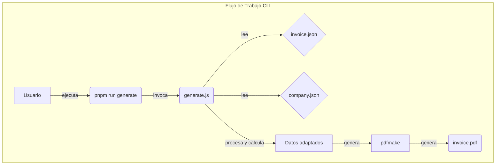
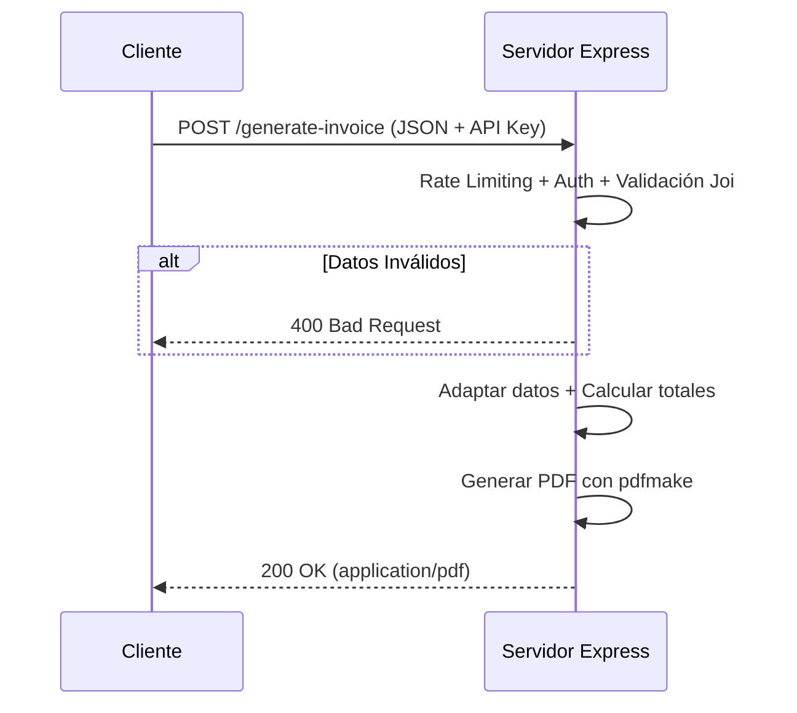

# Generador de Facturas en PDF con Node.js

Genera facturas y cotizaciones en PDF a partir de datos JSON. Usa **pdfmake** — sin Puppeteer, sin Chromium, sin dependencias pesadas.

Incluye CLI para uso directo y API REST lista para integrarse con n8n, Zapier, o cualquier backend.

---

## Diagramas de Flujo

### Flujo de Trabajo (CLI)



### Flujo de Trabajo (API)



---

## Características Principales

- **Ligero:** Solo pdfmake (~500KB). Sin Chromium (~400MB).
- **Generación Dual:** CLI y API REST.
- **Cálculos Automáticos:** Subtotales, IVA (porcentaje o absoluto), descuentos.
- **Total en Letras:** Conversión automática a texto en español.
- **Logo Incrustado:** Imágenes embebidas en base64, PDF autocontenido.
- **API Segura:** Auth por API Key + rate limiting.
- **Validación:** Esquemas Joi para datos de entrada.
- **Docker:** Imagen base `node:20-alpine` (~50MB vs ~800MB antes).

---

## Requisitos

- **Node.js**: v18.0 o superior
- **Gestor de Paquetes**: pnpm (recomendado) o npm

---

## Estructura del Proyecto

```
invoice_html_project/
├── generate.js                   # Script CLI
├── src/
│   ├── api/server.js             # Servidor Express (API REST)
│   ├── assets/                   # Logos y fuentes
│   ├── data/
│   │   ├── company.json          # Datos de la empresa
│   │   └── invoice.json          # Ejemplo de factura
│   ├── output/                   # PDFs generados
│   ├── templates/                # (legacy, pendiente eliminación)
│   └── utils/
│       ├── doc_definition.js     # Builder pdfmake
│       ├── invoice_schema.js     # Validación Joi
│       └── invoice_utils.js      # Lógica de negocio
├── tests/                        # Tests uvu
├── Dockerfile
└── package.json
```

---

## Instalación

```bash
git clone <repo-url>
cd invoice_html_project
pnpm install
```

---

## Uso por CLI

```bash
# Generar con datos por defecto
pnpm run generate

# Generar con archivos personalizados
node generate.js --data mi-factura.json --output mi-factura.pdf
```

---

## Uso como API REST

```bash
pnpm run api
```

### Endpoint

- **POST** `/generate-invoice`
- **Headers:** `Content-Type: application/json`, `x-api-key: supersecretkey`
- **Body:** JSON de la factura (ver `src/data/invoice.json` como ejemplo)
- **Respuesta:** PDF (`application/pdf`)

```bash
curl -X POST http://localhost:3000/generate-invoice \
  -H "Content-Type: application/json" \
  -H "x-api-key: supersecretkey" \
  --data-binary @src/data/invoice.json \
  --output factura.pdf
```

---

## Personalización

- **Logo:** Cambia archivos en `src/assets/` y actualiza `company.json`.
- **Fuente:** Coloca cualquier `.ttf` en `src/assets/fonts/` y registra en `doc_definition.js`.
- **Empresa:** Modifica `src/data/company.json`.
- **Estilos:** Edita los estilos en `doc_definition.js` (objeto `styles` y layouts de tabla).

---

## Tests

```bash
# Terminal 1: iniciar API
pnpm run api

# Terminal 2: ejecutar tests
pnpm run test
```

---

## Docker

```bash
docker build -t invoice-generator .
docker run -p 3000:3000 -e API_KEY=tu-clave invoice-generator
```

---

## Créditos

- [pdfmake](http://pdfmake.org) — generación de PDF en JavaScript puro
- Node.js, Express, Joi, pino
- Licencia MIT
