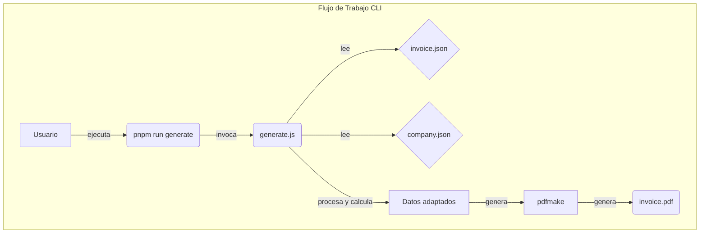
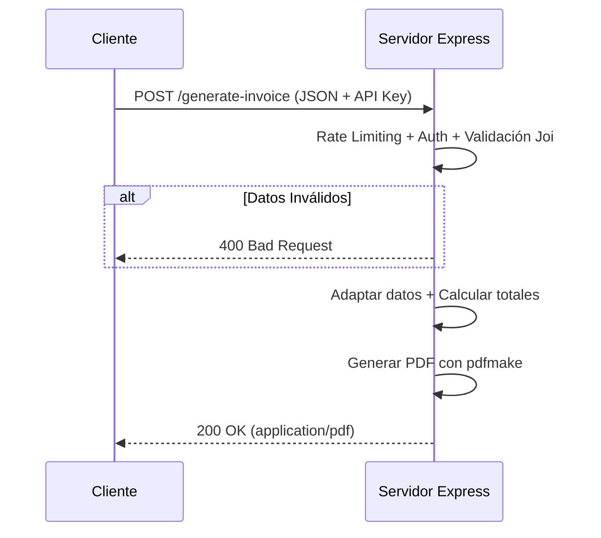

# Generador de Facturas en PDF con Node.js

Genera facturas y cotizaciones en PDF a partir de datos JSON. Usa **pdfmake** — sin Puppeteer, sin Chromium, sin dependencias pesadas.

Incluye CLI para uso directo y API REST lista para integrarse con n8n, Zapier, o cualquier backend.

---

## Diagramas de Flujo

### Flujo de Trabajo (CLI)



### Flujo de Trabajo (API)



---

## Características Principales

- **Ligero:** Solo pdfmake (~500KB). Sin Chromium (~400MB).
- **Generación Dual:** CLI y API REST.
- **Cálculos Automáticos:** Subtotales, impuestos múltiples (IVA, ICA, etc.), descuentos por item y global.
- **Total en Letras:** Conversión automática a texto en español.
- **Logo Incrustado:** Imágenes embebidas en base64, PDF autocontenido.
- **Multi-página:** La tabla de items fluye entre páginas sin header repetido; el footer lleva número de página en todas y el logo pequeño en la última.
- **API Segura:** Auth por API Key + rate limiting.
- **Validación:** Esquemas Joi para datos de entrada.
- **Docker:** Imagen base `node:20-alpine` (~50MB vs ~800MB antes).

---

## Requisitos

- **Node.js**: v18.0 o superior
- **Gestor de Paquetes**: pnpm (recomendado) o npm

---

## Estructura del Proyecto

```
invoice_html_project/
├── generate.js                   # Script CLI
├── src/
│   ├── api/server.js             # Servidor Express (API REST)
│   ├── assets/
│   │   ├── fonts/                # DanhDa-Bold (título) + Montserrat (cuerpo)
│   │   └── *.png                 # Logos
│   ├── data/
│   │   ├── company.json          # Datos de la empresa
│   │   ├── invoice.json          # Ejemplo de factura corta
│   │   └── factura-large.json    # Ejemplo de factura larga (multi-página)
│   ├── output/                   # PDFs generados (gitignored)
│   └── utils/
│       ├── doc_definition.js     # Builder de docDefinition para pdfmake
│       ├── invoice_schema.js     # Validación Joi
│       └── invoice_utils.js      # Lógica de negocio (totales, nº a texto)
├── tests/                        # Tests uvu (47 en total)
│   ├── api-invoice.test.js       # Integración API (requiere servidor)
│   ├── unit-doc_definition.test.js
│   └── unit-invoice_utils.test.js
├── Dockerfile
└── package.json
```

---

## Instalación

```bash
git clone <repo-url>
cd invoice_html_project
pnpm install
```

---

## Uso por CLI

```bash
# Generar con datos por defecto
pnpm run generate

# Generar con archivos personalizados
node generate.js --data mi-factura.json --output mi-factura.pdf

# Ejemplo de factura larga (multi-página)
node generate.js --data src/data/factura-large.json --output factura-larga.pdf
```

---

## Uso como API REST

```bash
pnpm run api
```

### Endpoint

- **POST** `/generate-invoice`
- **Headers:** `Content-Type: application/json`, `x-api-key: <tu-api-key>`
- **Body:** JSON de la factura (ver `src/data/invoice.json` como ejemplo)
- **Respuesta:** PDF (`application/pdf`)

```bash
curl -X POST http://localhost:3000/generate-invoice \
  -H "Content-Type: application/json" \
  -H "x-api-key: supersecretkey" \
  --data-binary @src/data/invoice.json \
  --output factura.pdf
```

La API Key por defecto es `supersecretkey` (configurable con `API_KEY`). Rate limit: 30 peticiones cada 15 minutos por IP.

---

## Personalización

- **Logo:** Cambia archivos en `src/assets/` y actualiza `company.json`.
- **Fuente:** Coloca cualquier `.ttf` en `src/assets/fonts/` y registra en `doc_definition.js` (sección `setupFonts`).
- **Empresa:** Modifica `src/data/company.json`.
- **Estilos:** Edita el objeto `styles` y los layouts de tabla en `doc_definition.js`.

---

## Impuestos y Descuentos

### Estructura JSON

```json
{
  "taxes": [
    { "name": "IVA", "rate": 19 },
    { "name": "ICA", "rate": 0.7 }
  ],
  "discount": {
    "global_rate": 5
  },
  "items": [
    {
      "code": "EXT-001",
      "name": "Columna Soxhlet",
      "quantity": 2,
      "unit_price": 450000,
      "discount_rate": 10,
      "taxable": true
    },
    {
      "code": "PH-001",
      "name": "pH-metro (exento)",
      "quantity": 1,
      "unit_price": 950000,
      "taxable": false
    }
  ]
}
```

### Impuestos (`taxes[]`)

Array de impuestos configurables. Cada uno tiene `name` (nombre visible) y `rate` (porcentaje).

```json
"taxes": [
  { "name": "IVA", "rate": 19 },
  { "name": "ICA", "rate": 0.7 },
  { "name": "INC", "rate": 8 }
]
```

- Se calculan sobre el subtotal **después** de descuentos por item.
- Aparecen como líneas separadas en la sección de totales del PDF.
- Si no se define `taxes[]`, se busca el campo legacy `iva` (compatibilidad hacia atrás).

### Descuento Global (`discount`)

Dos opciones (mutuamente excluyentes):

| Campo | Tipo | Ejemplo | Efecto |
|---|---|---|---|
| `global_rate` | Número 0-100 | `"global_rate": 5` | 5% del subtotal |
| `global_amount` | Número > 0 | `"global_amount": 500000` | $500.000 fijos |

Si no se define `discount`, se busca el campo legacy `descuento`.

### Descuento por Item (`item.discount_rate`)

Cada item puede tener su propio descuento:

```json
{ "code": "BAL-001", "name": "Balanza", "quantity": 5, "unit_price": 850000, "discount_rate": 10 }
```

- `discount_rate`: porcentaje (1-100) o valor absoluto (>100).
- Se resta del subtotal de ese item **antes** de calcular impuestos.
- Aparece como "Desc. items" en los totales si hay descuentos.

### Item Exento (`item.taxable`)

Marca un item como exento de impuestos:

```json
{ "code": "PH-001", "name": "pH-metro", "quantity": 1, "unit_price": 950000, "taxable": false }
```

- Por defecto: `true` (todos los items pagan impuestos).
- El flag es informativo y está disponible para futura extensión del cálculo.

### Orden de Cálculo

```
1. lineTotal    = quantity × unit_price
2. itemDiscount = lineTotal × discount_rate%
3. subtotal     = lineTotal - itemDiscount    (por item)
4. subtotal     = Σ items.subtotal            (global)
5. taxes        = subtotal × rate%            (cada impuesto)
6. total        = subtotal + Σtaxes - descuento_global
```

### Compatibilidad Legacy

Los campos anteriores siguen funcionando:

```json
{ "iva": 19, "descuento": 5 }
```

Si se define `taxes[]`, tiene prioridad sobre `iva`. Si se define `discount`, tiene prioridad sobre `descuento`.

---

## Tests

```bash
# Terminal 1: iniciar API (requerido solo para tests de integración)
pnpm run api

# Terminal 2: ejecutar todos los tests (47)
pnpm run test

# Solo unit tests (sin servidor)
npx uvu tests "unit-"
```

---

## Docker

```bash
docker build -t invoice-generator .
docker run -p 3000:3000 -e API_KEY=tu-clave invoice-generator
```

---

## Créditos

- [pdfmake](http://pdfmake.org) — generación de PDF en JavaScript puro
- Node.js, Express, Joi, pino
- Licencia MIT
